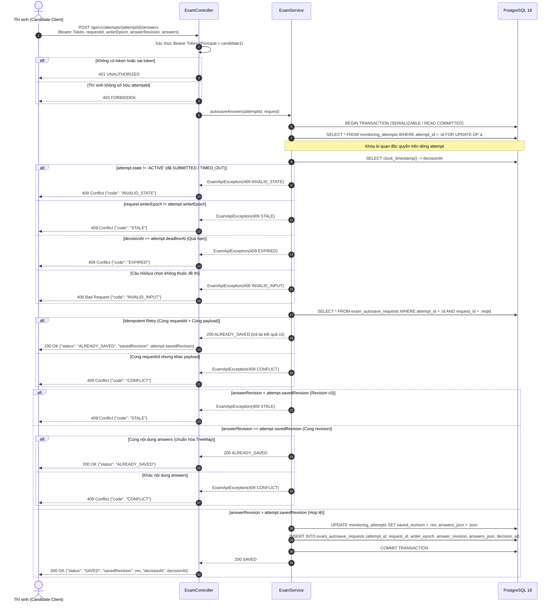
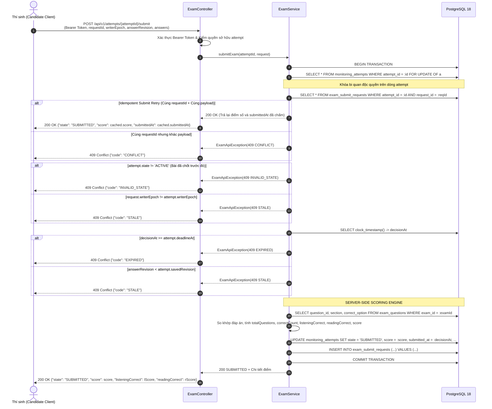
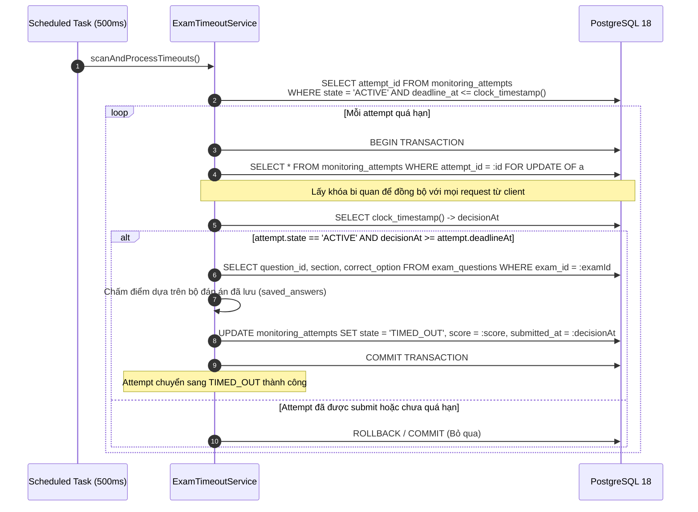
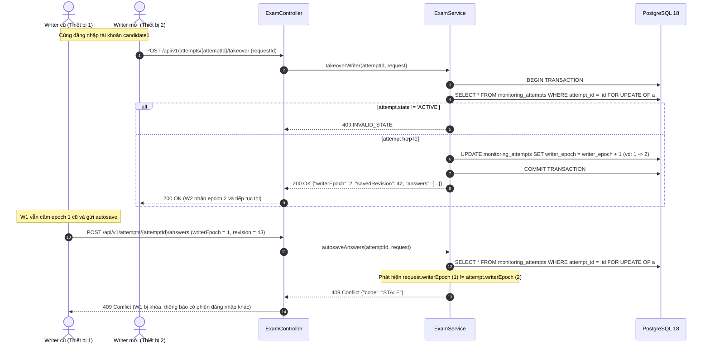

# Tài liệu Giao Dịch, Phân Quyền và Kiểm Thử Tranh Chấp (Vai A — Chặng 2)

Tài liệu kỹ thuật tổng hợp phục vụ báo cáo và bảo vệ đồ án môn học Lập trình Mạng.
- **Tác giả:** Người A (Vai A — Server, Cơ sở dữ liệu, Giao dịch, Đồng thời & Chấm điểm)
- **Mã Task:** `T2-A5`
- **Phiên bản:** 1.0 (Hoàn tất Chặng 2)
- **Cơ sở dữ liệu:** PostgreSQL 18.6
- **Môi trường:** Java 21+ / Spring Boot 4.x / Maven

---

## 1. Tổng quan Kiến trúc Giao dịch & An toàn Dữ liệu

Trong hệ thống thi TOEIC trực tuyến thời gian thực, các nguy cơ tranh chấp dữ liệu nghiêm trọng gồm có:
1. **Mất mát dữ liệu do nhiều kết nối cùng thí sinh (Multiple Writers):** Thí sinh mở 2 tab/thiết bị hoặc reconnect chậm làm rơi rớt dữ liệu cũ đè dữ liệu mới.
2. **Race condition giữa Nộp bài (Submit), Tự động lưu (Autosave) và Hết giờ (Timeout):** Request lưu bài muộn đến sau khi đã nộp hoặc sau khi đã hết giờ có thể làm thay đổi kết quả thi đã chốt.
3. **Vượt quyền truy cập qua tấn công đoán ID (IDOR) hoặc lạm dụng Idempotency Retry:** Kẻ xấu lợi dụng `requestId` hoặc `attemptId` của thí sinh khác để đọc/ghi bài thi.
4. **Sai lệch thời gian do chờ khóa bi quan (Lock Contention Time-skew):** Nếu request bị block chờ khóa hàng trong DB quá lâu, thời gian ghi nhận phải phản ánh đúng lúc có khóa thay vì lúc bắt đầu transaction.

### Cơ chế bảo vệ cốt lõi của Vai A:
- **Khóa bi quan theo dòng (Pessimistic Row-level Locking):** Mọi giao dịch thay đổi trạng thái bài thi (`autosave`, `submit`, `takeover`, `timeout`) đều thực hiện `SELECT ... FROM monitoring_attempts a WHERE a.attempt_id = :attemptId FOR UPDATE OF a`.
- **Đồng hồ thực sau khóa bằng `clock_timestamp()`:** Server không dùng `now()` (vốn là transaction start time) mà gọi `SELECT clock_timestamp()` **ngay sau khi đã giữ khóa thành công** để xác định `decisionAt`.
- **Thế hệ phiên ghi (`writerEpoch`):** Mỗi lần kết nối mới chiếm quyền ghi (`takeover`), `writerEpoch` được tăng thêm 1 trong DB. Mọi request mang epoch cũ đều bị từ chối 409 `STALE`.
- **Số hiệu phiên bản đơn điệu (`savedRevision`):** Đáp án lưu chỉ được tăng (`revision > savedRevision`), cấm ghi đè bản cũ.
- **Xác thực và phân quyền trước mọi thao tác (Zero-Trust Auth Gate):** Kiểm tra JWT/Bearer token và quyền sở hữu attempt trên từng request trước khi tra cache chống trùng hay xin khóa DB.

---

## 2. Sơ đồ Tuần tự Chi tiết (Sequence Diagrams)

### 2.1. Luồng Tự động lưu Đáp án theo Revision (`POST /api/v1/attempts/{attemptId}/answers`)



---

### 2.2. Luồng Nộp bài và Chấm điểm 1 lần (`POST /api/v1/attempts/{attemptId}/submit`)



---

### 2.3. Luồng Tác vụ Timeout Định kỳ (`ExamTimeoutService`)



---

### 2.4. Luồng Chiếm quyền ghi (Takeover Writer) & Phục hồi phiên khi Reconnect



---

## 3. Bảng Mẫu Phản hồi Chuẩn (Standard Response Samples)

### 3.1. Phản hồi Thành công (Success 200 OK)

#### A. Autosave thành công (`200 OK`):
```json
{
  "requestId": "req-save-101",
  "attemptId": "SESSION-2026-candidate1",
  "status": "SAVED",
  "savedRevision": 42,
  "writerEpoch": 1,
  "decisionAt": "2026-10-05T16:20:00.123Z"
}
```

#### B. Autosave đã lưu từ trước / Idempotent Retry (`200 OK`):
```json
{
  "requestId": "req-save-101",
  "attemptId": "SESSION-2026-candidate1",
  "status": "ALREADY_SAVED",
  "savedRevision": 42,
  "writerEpoch": 1,
  "decisionAt": "2026-10-05T16:20:00.123Z"
}
```

#### C. Nộp bài thành công (`200 OK`):
```json
{
  "requestId": "req-submit-001",
  "attemptId": "SESSION-2026-candidate1",
  "state": "SUBMITTED",
  "totalQuestions": 10,
  "correctCount": 8,
  "listeningCorrect": 4,
  "readingCorrect": 4,
  "score": 8,
  "submittedAt": "2026-10-05T16:25:00.456Z",
  "decisionAt": "2026-10-05T16:25:00.456Z",
  "savedRevision": 43
}
```

#### D. Takeover Writer thành công (`200 OK`):
```json
{
  "requestId": "req-takeover-001",
  "attemptId": "SESSION-2026-candidate1",
  "writerEpoch": 2,
  "savedRevision": 42,
  "state": "ACTIVE",
  "deadlineAt": "2026-10-05T18:00:00Z",
  "answers": {
    "L1": "A",
    "R1": "B"
  }
}
```

#### E. Tra cứu trạng thái phục hồi (`GET /status` — `200 OK`):
```json
{
  "attemptId": "SESSION-2026-candidate1",
  "sessionId": "SESSION-2026",
  "examId": "EXAM-TOEIC-SAMPLE-10",
  "candidateUsername": "candidate1",
  "writerEpoch": 2,
  "savedRevision": 42,
  "state": "ACTIVE",
  "startedAt": "2026-10-05T16:00:00Z",
  "deadlineAt": "2026-10-05T18:00:00Z",
  "answers": {
    "L1": "A",
    "R1": "B"
  },
  "totalQuestions": 10,
  "score": null,
  "submittedAt": null
}
```

---

### 3.2. Phản hồi Lỗi Nghiệp vụ (Error Responses)

#### A. Stale Revision / Stale Writer Epoch (`409 Conflict`):
```json
{
  "code": "STALE",
  "message": "Phiên bản đáp án (revision 41) hoặc writer epoch cũ hơn dữ liệu máy chủ hiện có."
}
```

#### B. Conflict Payload / Mâu thuẫn cùng Revision (`409 Conflict`):
```json
{
  "code": "CONFLICT",
  "message": "Xung đột nội dung: RequestId hoặc Revision đã tồn tại với nội dung đáp án khác."
}
```

#### C. Hết giờ làm bài (`409 Conflict`):
```json
{
  "code": "EXPIRED",
  "message": "Ca thi đã hết thời gian quy định (decisionAt >= deadlineAt)."
}
```

#### D. Thao tác trên bài thi đã chốt / nộp lại (`409 Conflict`):
```json
{
  "code": "INVALID_STATE",
  "message": "Không thể thực hiện thao tác: Lượt thi đã ở trạng thái kết thúc (SUBMITTED hoặc TIMED_OUT)."
}
```

#### E. Câu hỏi không thuộc đề thi (`400 Bad Request`):
```json
{
  "code": "INVALID_INPUT",
  "message": "Câu hỏi L99 không tồn tại trong đề thi của lượt thi này."
}
```

#### F. Truy cập trái phép / Không có quyền trên attempt (`403 Forbidden`):
```json
{
  "code": "FORBIDDEN",
  "message": "Thí sinh không có quyền truy cập hoặc thao tác trên lượt thi này."
}
```

---

## 4. Bằng chứng Trích xuất Log & Truy vấn Thực tế

Đoạn log trích xuất từ kịch bản kiểm thử PostgreSQL 18 thật ([`ExamConcurrencyPostgresSmoke`](file:///c:/Users/Lenovo/OneDrive/Máy%20tính/LTM/Toeic-Monitoring-Realtime/server/src/test/java/vn/edu/toeic/server/exam/ExamConcurrencyPostgresSmoke.java)):

```sql
-- 1. Khóa bi quan độc quyền trên attempt của thí sinh:
SELECT attempt_id, session_id, exam_id, candidate_user_id, state, deadline_at, writer_epoch, saved_revision, answers_json
FROM monitoring_attempts a
WHERE a.attempt_id = 'SESSION-T2A4-candidate1'
FOR UPDATE OF a;

-- 2. Lấy thời điểm quyết định chính xác sau khi đã giữ khóa thành công:
SELECT clock_timestamp();
-- Kết quả trả về: 2026-10-05 16:40:48.214532+00

-- 3. Kiểm tra nhật ký chống trùng (Idempotency Request Log):
SELECT attempt_id, request_id, writer_epoch, answer_revision, answers_json, decision_at
FROM exam_autosave_requests
WHERE attempt_id = 'SESSION-T2A4-candidate1' AND request_id = 'req-save-01';

-- 4. Cập nhật trạng thái và đáp án:
UPDATE monitoring_attempts
SET saved_revision = 42,
    answers_json = '{"L1":"A","R1":"B"}'
WHERE attempt_id = 'SESSION-T2A4-candidate1';
```

Log thực thi kiểm thử AT07, AT09, AT10:
```text
DB Connection acquired lock FOR UPDATE on SESSION-T2A4-candidate2
PASS: Lock holder acquired pessimistic lock
DB Connection committed and released lock on SESSION-T2A4-candidate2
PASS: AT07: HTTP request completed after lock release
PASS: AT07: Request blocked waiting for lock past deadline is rejected with 409
PASS: AT07: Response error code is EXPIRED
--- Running AT09: Writer Takeover & Stale Writer Concurrency ---
PASS: AT09 lock holder acquired lock
PASS: AT09: Writer 1 request completed
PASS: AT09: Writer 1 with stale epoch rejected with 409
PASS: AT09: Error code is STALE
PASS: AT09: Takeover writer endpoint returns 200 OK
PASS: AT09: New writerEpoch is 3
PASS: AT09: Writer 2 with writerEpoch=3 saves successfully
PASS: Status endpoint returns 200 OK on reconnect
PASS: Status has writerEpoch = 3
PASS: Status has savedRevision = 1
PASS: Status has state = ACTIVE
PASS: Status answers contains L1=A
--- Running AT10: Tampering After Final & Delayed Timeout Job ---
PASS: AT10: Save after deadline rejected with 409 EXPIRED without waiting for timeout job
PASS: AT10: Error is EXPIRED
PASS: AT10: Submit after deadline rejected with 409 EXPIRED without waiting for timeout job
PASS: AT10: Error is EXPIRED
```

---

## 5. Lập luận Kỹ thuật Phục vụ Bảo vệ Đồ án (Defense Q&A)

### Câu hỏi 1: Vì sao phải dùng `clock_timestamp()` sau khi có khóa thay vì `now()`?
> **Trả lời:**
> Trong PostgreSQL, hàm `now()` (hoặc `CURRENT_TIMESTAMP`) trả về **thời điểm bắt đầu giao dịch (transaction start time)** và giữ nguyên giá trị không đổi trong suốt transaction đó.
> Nếu Request B đến lúc 09:59:59 (trước deadline 10:00:00) nhưng bị chặn chờ khóa do Request A đang giữ khóa đến 10:00:05 mới nhả, thì:
> - Nếu dùng `now()`: Request B sẽ lấy giờ là 09:59:59 (trước deadline) -> **chấp nhận lưu bài quá hạn sai luật**.
> - Nếu dùng `clock_timestamp()` sau khi đã có khóa: PostgreSQL trả về **thời gian đồng hồ thực tế tại đúng thời điểm câu lệnh được thực thi** (10:00:05) -> phát hiện `decisionAt >= deadlineAt` và từ chối 409 `EXPIRED` ngay lập tức, đảm bảo tính công bằng tuyệt đối.

### Câu hỏi 2: Vì sao kiểm tra Idempotency (chống trùng request) không thể bị lợi dụng để vượt quyền?
> **Trả lời:**
> Trong thiết kế của hệ thống, **Xác thực danh tính (Authentication) và Phân quyền (Authorization)** luôn được đặt tại **Gate 1** (trước khi vào service layer, trước khi mở transaction và trước khi tra cứu bảng idempotency log).
> Khi một request gửi lên mang `requestId` của người khác:
> 1. Server kiểm tra Bearer token trong Security Filter và trích xuất `AuthenticatedUser`.
> 2. Server đối chiếu `candidateUserId` của user với chủ sở hữu `attemptId` trong DB.
> 3. Nếu không phải chủ sở hữu hợp lệ, server trả ngay **`403 FORBIDDEN`** mà không hề đọc bảng `exam_autosave_requests` hay `exam_submit_requests`. Do đó, kẻ xấu không thể mạo danh hay đọc trộm dữ liệu qua cơ chế idempotency.

### Câu hỏi 3: Hai request Save và Submit đến cùng lúc thì hệ thống xử lý thế nào?
> **Trả lời:**
> Nhờ cơ chế khóa bi quan `SELECT ... FOR UPDATE OF a`, PostgreSQL sẽ tuần tự hóa (serialize) 2 request này:
> - **Trường hợp Submit lấy được khóa trước:** Submit sẽ chấm điểm, chuyển `state = 'SUBMITTED'` và commit. Sau đó Save mới lấy được khóa, đọc `state` thấy không còn `ACTIVE` nên từ chối ngay với **`409 INVALID_STATE`** mà không làm thay đổi bài thi.
> - **Trường hợp Save lấy được khóa trước:** Save cập nhật `savedRevision` và commit. Sau đó Submit lấy khóa, kiểm tra revision của submit `>= savedRevision` thì tiếp tục chấm điểm và chốt bài an toàn.

### Câu hỏi 4: Cơ chế `writerEpoch` giải quyết bài toán gì trên thực tế?
> **Trả lời:**
> `writerEpoch` ngăn chặn hiện tượng **Split-brain Writer** khi thí sinh gặp sự cố mạng hoặc mở nhiều tab:
> - Giả sử máy 1 bị mất mạng tạm thời nhưng tiến trình cũ vẫn đang cố gửi autosave với đáp án cũ.
> - Thí sinh chuyển sang máy 2, đăng nhập và gọi `takeover`. Server tăng `writerEpoch` từ 1 lên 2.
> - Khi mạng máy 1 hồi phục và gửi gói tin cũ với `writerEpoch = 1` lên server, server so sánh thấy epoch cũ hơn `writerEpoch` hiện hành (2) và từ chối ngay với **`409 STALE`**, ngăn chặn hoàn toàn việc dữ liệu cũ ở máy 1 ghi đè lên bài làm mới ở máy 2.
